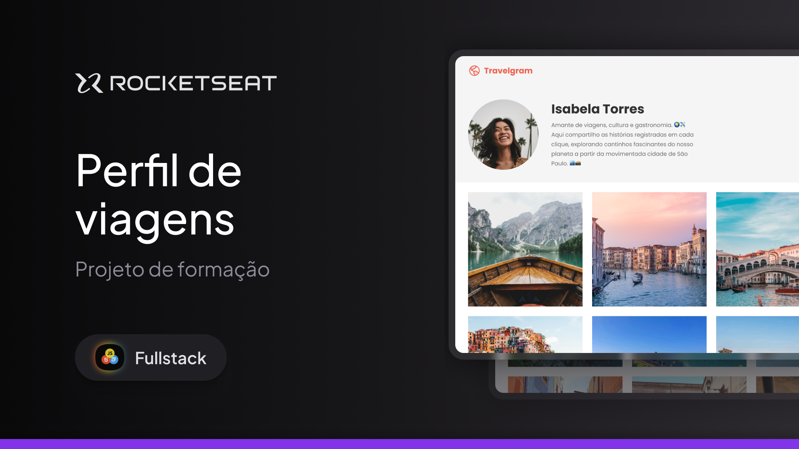

  

Projeto de uma landing page de perfil de viagens, desenvolvido durante as aulas sobre HTML e CSS.

  <a href="#-tecnologias">Tecnologias</a>&nbsp;&nbsp;&nbsp;|&nbsp;&nbsp;&nbsp;
  <a href="#-projeto">Projeto</a>&nbsp;&nbsp;&nbsp;|&nbsp;&nbsp;&nbsp;
  <a href="#memo-licença">Licença</a>

  

 

  

## 🚀 Tecnologias

Esse projeto foi desenvolvido com as seguintes tecnologias:

- HTML
- CSS

## Projeto

Nesse projeto você vai criar o layout do perfil de uma rede social de fotos de viagem. 
Esse é um dos projetos desenvolvidos em aula na formação Full-stack, um de nossos conteúdos de especialização.